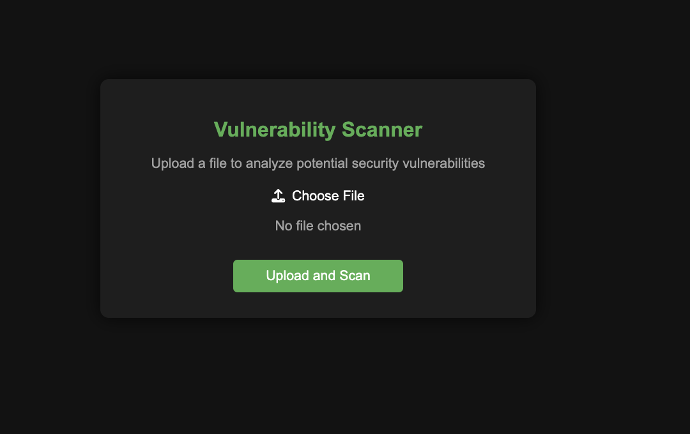

# CodeSec Analyzer



## Sobre o Repositório

Este repositório contém uma aplicação web para análise de vulnerabilidades de código. A ferramenta permite o upload de arquivos de código fonte, que são enviados para uma API de análise de segurança. O objetivo é identificar possíveis vulnerabilidades em linguagens como Python, JavaScript, Java, Go, entre outras.

## Funcionalidades

### 1. Upload de Arquivos de Código
Permite o upload de arquivos de código com as seguintes extensões: `.py`, `.js`, `.java`, `.go`, `.ts`, `.cpp`, `.c`, `.rb`, e `.php`. A ferramenta garante que apenas arquivos de código fonte sejam aceitos, fornecendo feedback imediato ao usuário.

### 2. Análise de Vulnerabilidades
Após o upload do arquivo, ele é enviado para uma API que realiza uma análise de segurança e retorna as vulnerabilidades encontradas. Os resultados são exibidos diretamente na interface do usuário.

### 3. Feedback ao Usuário
A aplicação fornece feedback em tempo real, como validação de tipos de arquivos suportados e desabilitação do botão de envio até que um arquivo válido seja selecionado.

## Como Usar

1. Clone o repositório:
   ```bash
   git clone https://github.com/devGabyAlves/CodeSec-Analyzer.git

2. Navegue até o diretório do projeto:
    ```bash
    cd Security-Upload

3. Instale as dependências do projeto:
    pip install 

4. Acesse a aplicação no navegador:
    [npm start](http://localhost:3000)

### 4. Tecnologias Utilizadas
- React: Biblioteca JavaScript utilizada para a construção da interface do usuário.
- TypeScript: Superset do JavaScript que adiciona tipagem estática ao código.
- Axios: Biblioteca usada para fazer as chamadas à API de análise de vulnerabilidades.
- Font Awesome: Para os ícones visuais.

## Contribuição

Sinta-se à vontade para contribuir com melhorias ou novos exemplos de segurança para este repositório. Você pode abrir uma issue ou enviar um pull request.

## Licença

Este projeto está licenciado sob os termos da MIT License.